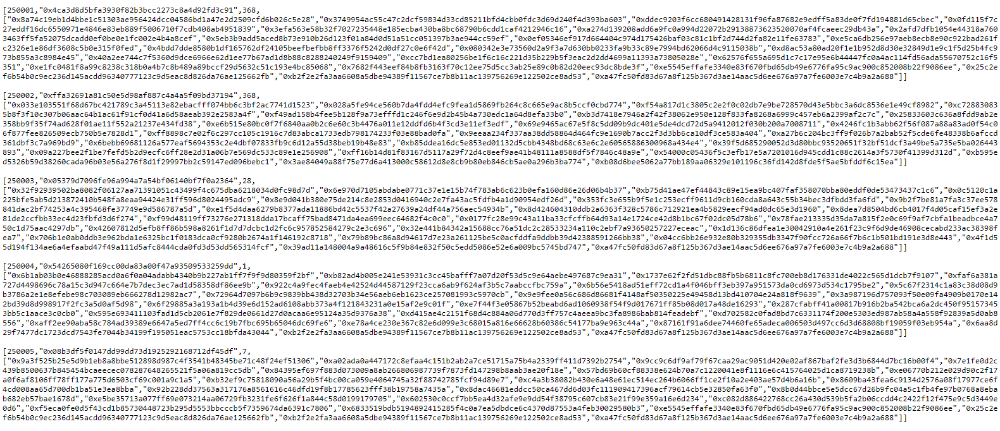
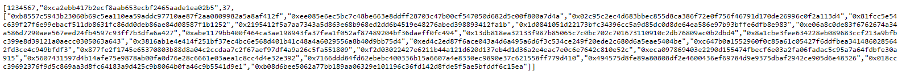
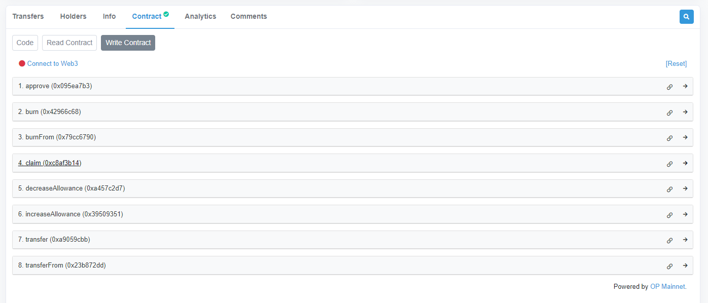
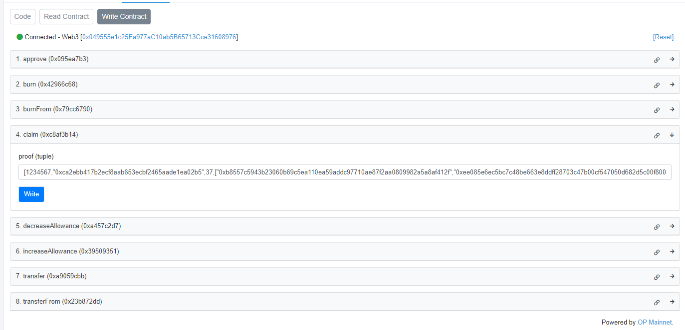

# Introduction  
SDT (Strictly Decentralized Token) is an erc20 token and a merkle airdrop where early XEN minters with a rank from 1 to 3,200,000 can claim an amount equal to the mint term. 
The tokens are on the Optimism Network.
The code is immutable and anyone can easily verify that it was done fairly and correctly. There is no premine or dev allocation. All supply goes to the 3.2M crank owned by XEN minters.

# How to Claim SDT

1. Locate your crank in the proof file. There are 320 files in the proofs folder named proof000.txt to proof319.txt. Each file has a group of 10,000 entries. For example you own crank 1,234,567 open proof123.txt https://raw.githubusercontent.com/ph4n70mr1ddl3r/sdt/main/proofs/proof123.txt and locate the crank.

2. Copy the whole block of data.

3. Open https://optimistic.etherscan.io/token/0x178ef5ecbcad4f79b31aef02ed2e4e28f778cfe0#writeContract and connect your wallet by pressing "Connect to Web3".

4. Expand the claim function and put the claim data in the proof field. Then press Write to execute the transaction. Approve the transaction and wait for your SDT tokens.

# Notes:  
You can use any account in Optimism to claim and pay for gas but the SDT tokens will always go to the proper address in the proofXXX.txt file. It will cost about 0.00007 ETH to claim.
